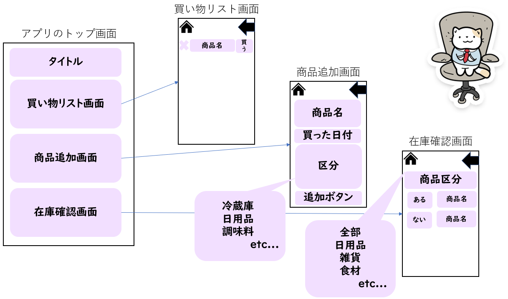

# 画面の構成とテーブル(MicrosoftDataverse)の構成

## 画面の構成
 - 買い物リスト画面
 - 商品追加画面
 - 在庫確認画面

上記3はどうしても分けたい！！

ということで、こんな感じになりました。

<!-- ../が1個上に上がる
 　　※imgの中のfaviiconのところに記事を書いているとすると../../になる
 　　../で１個上に上がる＝assetsにる/imgの中の/写真-->
<!-- </img>　 -->

猫様かわいかったからつけてみたｗ

## テーブル(MicrosoftDataverse)の構成
### テーブル１（商品追加画面/在庫確認画面で使用）
|名前|データ型|
|:-:|:-:|
|購入日|日付のみ|
|商品名|テキスト|
|商品区分|選択|

商品区分の選択
 - 野菜
 - お肉
 - 冷凍食品
 - 惣菜
 - 調味料
 - 日用品
 - 在庫商品

### テーブル2（買い物リスト画面で使用）
|名前|データ型|
|:-:|:-:|
|商品名|テキスト|

